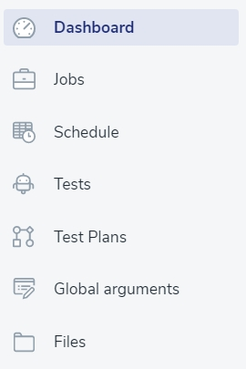
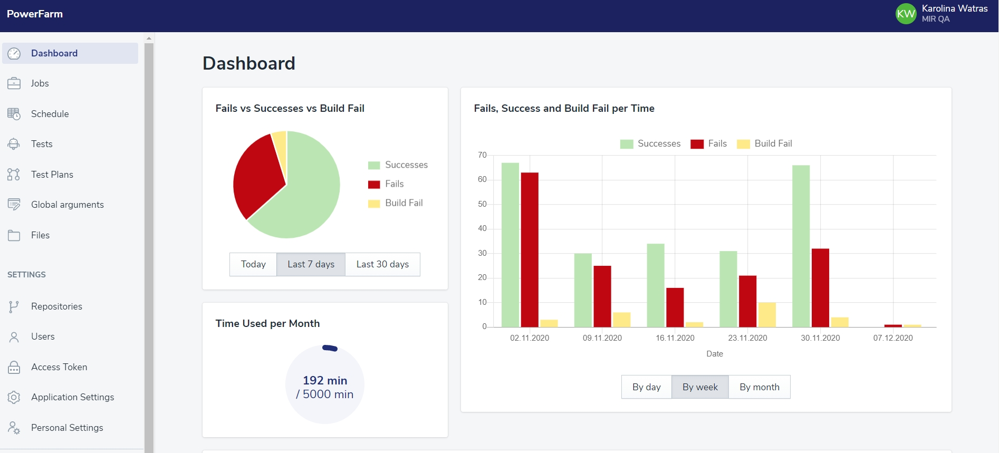
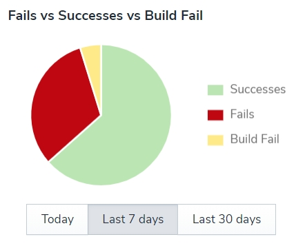

# Dashboard

In this space, you can check how your organization's productivity is depicted graphically. You can see how many tests have been created per various periods and how many were successfully built.

If there was no activity in your organization whatsoever, the dashboard will be grayed.

## Fails vs Successes vs Build Fail

The pie chart provides a clear insight into which of the statuses prevailed in a given period.
If you want to know the quantity of a certain status, go on it with the cursor.

## Time Used per Month

On this chart, you will see how many minutes of your monthly plan has been used to this moment. 

## Fails, Success and Build Fail per Time

From this chart, you will learn how many Tests have been built in a given period, and how many of them were success or fail.

