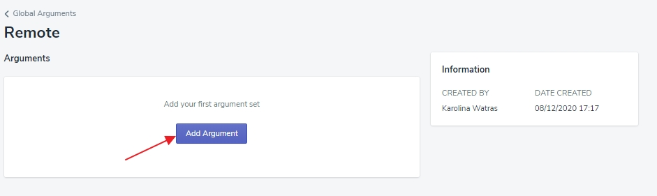
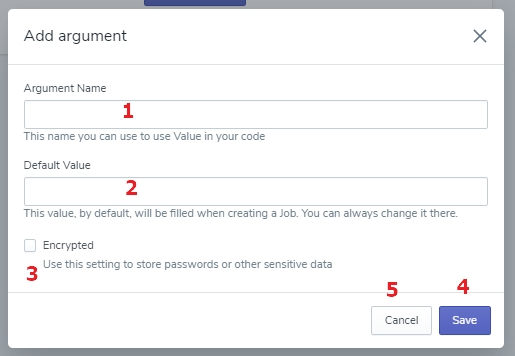
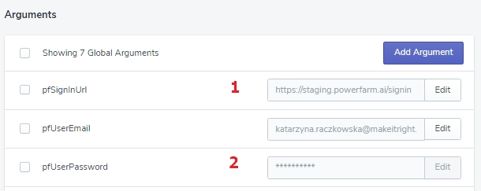

# Global Arguments

There are two types of Arguments used in PowerFarm: 
1. Global Arguments - can be added to every Job 
2. Local Arguments - are added to certain Job

From the level of main menu, the User can create the Global Arguments since **they might be selected and added to every new Job in the Platform** - the list of them will be available on the form for creating Jobs. 

The space with all Global arguments contains:
1. the 'Create Global arguments' button
2. sorting by the order of creating
3. the 'Delete' button

## Create Global arguments

First, name your set of arguments: click the ‘Create Arguments Collection’ button, type the name **1**, and save it **2** or dismiss the action **3**. 

The application will open the page where you can add as many arguments as you wish by clicking on the ‘Add Argument’ button. 

Fill the displayed form by entering Argument name **1**, and Default Value **2**. If the argument is to be encryptet, check the box **3**. Save changes **4** or dismiss action **5**.

> **Notice**, created Global arguments are visible on the list and can be edited later **1**, but encrypted arguments are unavailable and not editable **2**.

