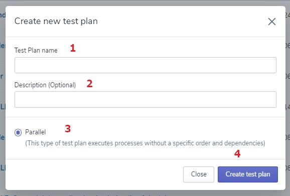

# Creating the Test Plan

Click the ‘Create new Test Plan' button on the top right corner of the screen to display the form to fill. 

For now, you only provide the Test Plan's name, an optional description, and choose a Parallel💬 checkbox (in case it's not checked yet). Once you click the ‘Save’ button, your new Test Plan will appear on the list. 

>💬 Definition alert! 🔔
**Parallel** - scripts are executed at the same time without any dependencies.

Select your new Parallel Test Plan from the list to display the details on the screen and add a Flow to it. 
It’s easy - just click the ‘Add Test to the Test Plan' button on the bottom of the page and choose as many Tests as you wish by clicking at the ‘Add’ button next to them on the displayed form.

<!-- theme: warning -->
>💡 **Remember**, the form will show all created Tests in the application, so make sure you have a proper amount on the Tests list to practice this step.

Once you’ve finished adding Tests to your new Test Plan, confirm this action by clicking the ‘Save Test for Test Plan'. If you want to dismiss it, click the ‘Close’ button and none of the chosen Processes will be added. 

<!-- theme: success -->
>Excellent! Give yourself pat on the back and keep on. 👊