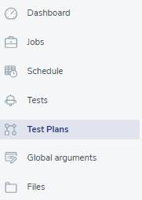

# Test Plans

Creating the Test Plan 💬  is another step in your adventure with PowerFarm. And it’s not a complicated operation either.

>💬 Definition alert! 🔔
>**Test Plan** - Set of scripts that can be executed in a sequence or simultaneously without any dependencies. Each test plan can consist of multiple tests. 
