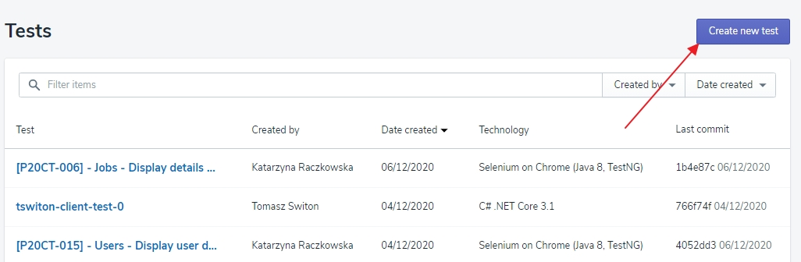
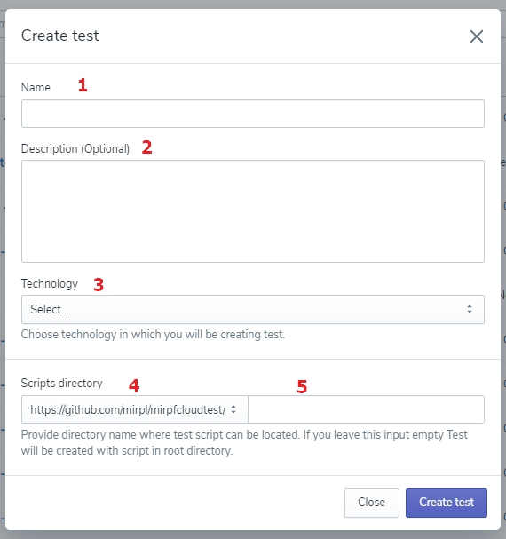

# Creating the Test

First, select the 'Tests' button on the left side of the screen and click the ‘Create New Test' button on the top right corner. 
It doesn’t sound complicated, right? 😎

Now, fill the displayed form:

**1**. Name your Test, and do it wisely, so that you and other users could find it easily later. 

<!-- theme: warning -->
>💡 **Remember**, you can use all kinds of letters and signs along with spaces while entering the Test name.

**2**. Add the Test description. 

<!-- theme: warning -->
>💡 Although it is an optional action, we **recommend** you to fill this space, too; it will make navigating on the list of all Tests easier both for you and other users. 

**3**. Select technology: just drop-down the list of technologies in which you wrote your test script and click the one you need. 

**4**. Now, select one of the script directories - also accessible on the drop-down list - and **5** enter the path to the script you want to use in this Test.

<!-- theme: warning -->
>💡 **Remember** that you can add a new repository by the [Settings](../Settings/Repositories.md) menu. 

Are you absolutely sure entered data is just as you like it? If so, don’t hesitate to click the ‘Create new Test' button. 

It isn’t what you want to have on your list? Simply click the ‘Cancel’ button and come back to the form later. Only remember - there are no drafts here. 

<!-- theme: success -->
>Awesome! Your first Test has been created! 🙌

But it doesn’t mean your job is done here. 

Click created test and check out the Test details.
