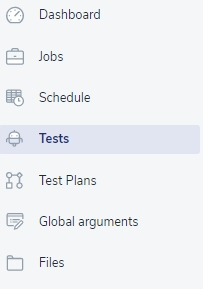
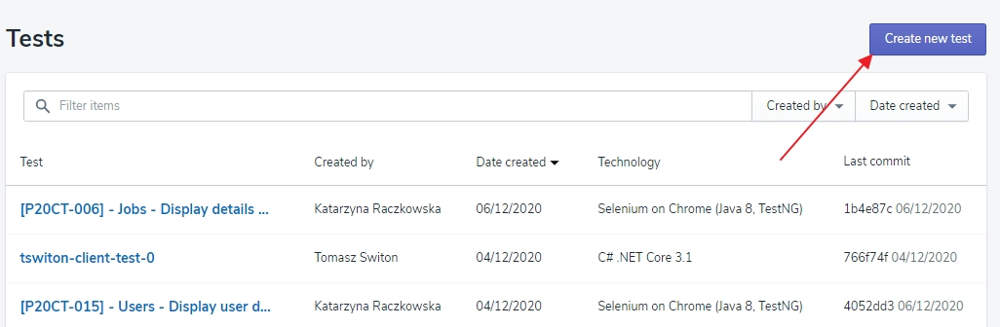
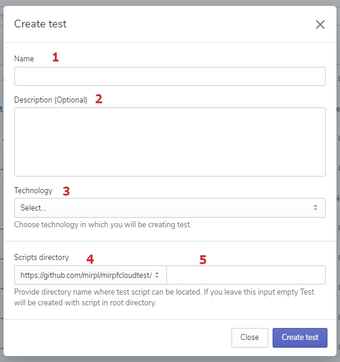
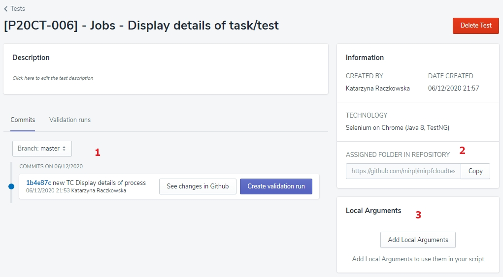

# Tests

Everything good and exciting about PowerFarm starts with creating the new Test  💬. 

<!-- theme: info -->
>💬** Definition alert!** 🔔
>**Test** - Single test script that can work on its own and perform one task. It can be combined with other scripts to create the whole scenario of the test case.

## Creating the Test

First, select the 'Tests' button on the left side of the screen and click the ‘Create New Test' button on the top right corner. 
It doesn’t sound complicated, right? 😎

Now, fill the displayed form:

**1**. Name your Test, and do it wisely, so that you and other users could find it easily later. 

<!-- theme: warning -->
>💡 **Remember**, you can use all kinds of letters and signs along with spaces while entering the Test name.

**2**. Add the Test description. 

<!-- theme: warning -->
>💡 Although it is an optional action, we **recommend** you to fill this space, too; it will make navigating on the list of all Tests easier both for you and other users. 

**3**. Select technology: just drop-down the list of technologies in which you wrote your test script and click the one you need. 

**4**. Now, select one of the script directories - also accessible on the drop-down list - and **5** enter the path to the script you want to use in this Test.

<!-- theme: warning -->
>💡 **Remember** that you can add a new repository by the [Settings](../Settings/Repositories.md) menu. 

Are you absolutely sure entered data is just as you like it? If so, don’t hesitate to click the ‘Create new Test' button. 

It isn’t what you want to have on your list? Simply click the ‘Cancel’ button and come back to the form later. Only remember - there are no drafts here. 

<!-- theme: success -->
>Awesome! Your first Test has been created! 🙌

But it doesn’t mean your job is done here. 

Click created test and check out how to edit your Test.

## Edit the Test

Click the Test's name to open it and check the essential details displayed on the screen you didn’t have access to while creating it. 

The list of commits **[1]** will be empty until you push commits in your repository.
Find the space ASSIGNED FOLDER IN REPOSITORY **[2]**, copy the link to your repository, and go to it to execute your first commits. 

<!-- theme: success -->
>Well done! 👌

Now you can see the commits notification in Test details and continue your work.

It’s time to add Local Arguments 💬 **[3]** to your Test by clicking the ‘Add Local Arguments’ button and filling the form displayed on the screen. 

Enter the Argument name **1 **and the Default value **2**, and click the ‘Save’ button **3** or dismiss this action clicking the ‘Close’ button **4**. You can add as many Arguments as you wish and the list of all Arguments will be visible in the Process details. 

>💬 Definition alert! 🔔
>**Local arguments** - defined values with a name your test can use when executing, assign to every single script.
