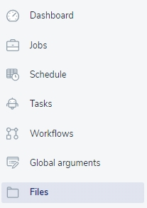
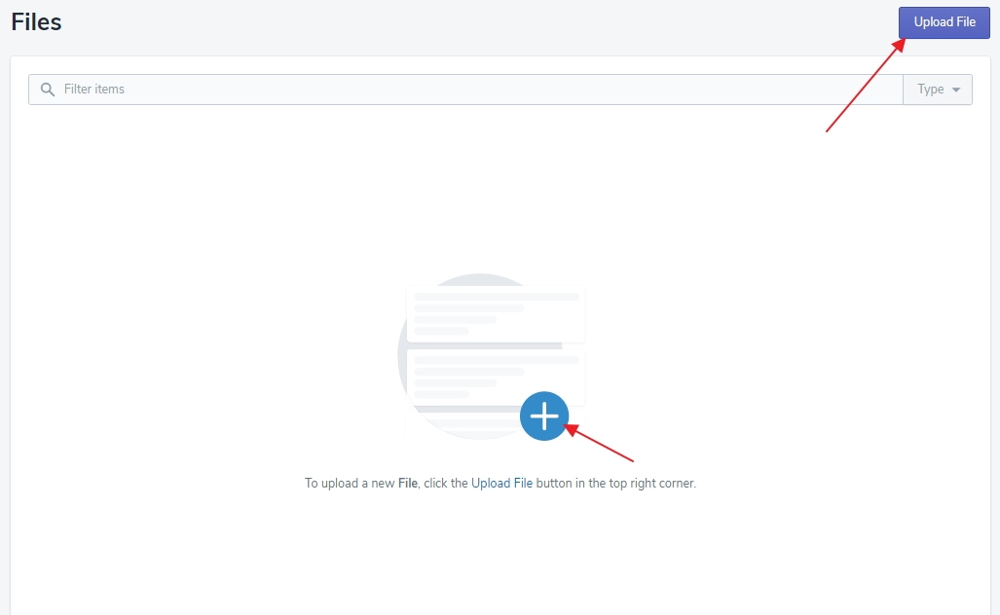
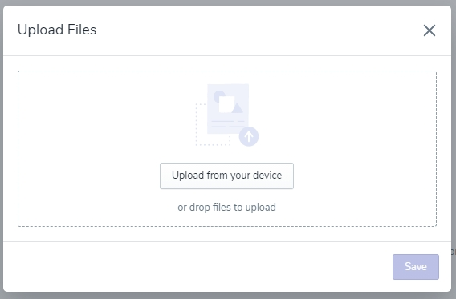

# Files

The file system lets both uploading and saving files on the platform. Thanks to that, the files can be used as a test input or saved as the test output.

To upload a new file, click the 'Upload File' button on the top right corner of the screen or the big plus icon in the middle.

Next, upload the file from your device or drop it directly to the window, and click the 'Save' button.

