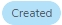
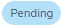
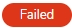
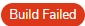
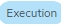
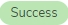

# Job details

The page with the Job containing Parallel Test Plan allows you to check the following details you didn’t have access to from the [list page]():

1. Job name
2. Status
3. Start Date
4. End Date
5. Execution Time
6. Test Plan information - ‘Type’ & ‘Created by’, along with the ‘Go to Test Plan' link, moving the user to the Test Plan page.
7. The ‘Return Job’ button - 
8. The 'Delete' button
9. Test name - along with the link opening the window displaying the results of the Test execution
10. Status of the Test
11. The commit used in the Test
12. Test end date
13. The 'Show results' button
14. Filter for tests

## Show results

- Output - displayed in JSON format
- Input parameters - Name & Value
- Generated files 
- Screenshots

## Rerun Job

### Statuses
Now, let’s look closely at the statuses, and what they really mean. 👀

When the Job has been ordered, but its execution hasn't started yet ??. In Details space, you will see the info: ‘No jobs were created for this order”, and there will be no Start and End Time provided. 

 When a new Job is created.

 When the Job is canceled by the user before it starts execution.

 When at least one connected Test is pending (and others can be created).

 When one of the Tests cannot be built, or the order cannot be submitted to the queue 😟. When you go to check the results, you will see the respective info in the ‘Output’ window. 

 When a robot could not be built.

  When at least one Test is currently running

 When the execution of this Job succeeded 😀. When you go to see the results, you will see the respective info in the ‘Output’ window.

You've gone so far in this exciting journey 👏. Catch some breath, and let's move on!