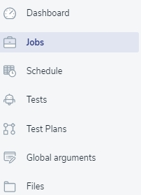
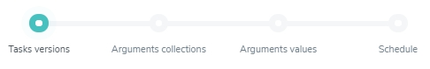
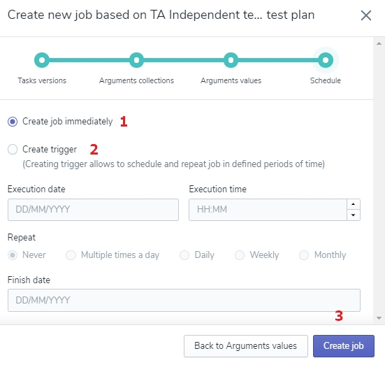

# Jobs - create and edit

You now know how to create Tests and Test Plans, but to start the actual experience of Test Automation, you need to create the Job 💬.

>💬 Definition alert! 🔔
**Job** - Execution of a Test Plan.

## Create a New Job

There are two ways of creating a new Job. 
1.  find the ‘Create Job’ button on the Test Plan list, next to every Test Plan.

2. open Test Plan's details and find the ‘Create Job’ button in the top right corner of the page. 

Clicking the ‘Create Job’ button will open the form to fill in.

<!-- theme: warning -->
>💡 **Remember**, if the button is unclickable, the Tests were not added to the Test Plan yet.

<!-- theme: info -->
>💡 **Notice**, you can return to the added Test details page by clicking the ‘Go to Test' button. 

Filling in the ‘Create New Job’ form consists of four steps. A separate form and graphic pointer outline each of them:

### Choose Versions of the Test

The form of choosing the Test Version displays every Test added to the Test Plan. For each of them, select branch **1** along with commit you want to use for this Job.

<!-- theme: warning -->
>💡 **Remember**, if there were no commits in the Test, you cannot select Branch and Commit.

Next, select the Tag **2** and Commit hash 💬 **3**. 

<!-- theme: info -->
>💡 **Notice**, choosing both Tags and Commit hash is optional for every Test.

>💬 Definition alert! 🔔
**Commit hash** - the code version used by the Test

If you want that every test of this Job had the same values, click the 'Copy values to other Tests' button **4**.

Confirm by clicking the 'Save ang go to Arguments collections' button **5**.

### Choose Arguments Collections

In the second step, choose Global Arguments 💬 you want to add to this Job. If there are many arguments on the list, use the filter above it **1**, and click the ‘Save and go to Arguments’ button **2**. 

<!-- theme: warning -->
>💡 **Remember**, collections of Global Arguments are created in the [Global Arguments]() menu.

>💬 Definition alert! 🔔
**Global Arguments** - sets of values with names you can predefine globally and use when executing a set of tests (such as environment URLs or login credentials).
### Define Arguments Values

In the third step, you can edit the Local Arguments you added while creating the Tests. They will be used for this Job execution.

<!-- theme: warning -->
>💡  **Remember**, if you set Global Arguments in the previous step, they will be overriding for the Local Arguments.
### Executing the Job

In the fourth step, choose one of two available methods of executing the Job:
Create Job immediately 💬 **1** or Create Trigger 💬 **2**. 

>💬 Definition alert! 🔔
**Immediate Job** - the Job executed right away after creating it.
Trigger - an instruction to execute scripts on defined date and time.

#### Create Job Immediately 
That’s straight forward action - the Job will be executed right away after clicking the ‘Create Job’ button. 
The form will be shut down and you will see the window confirming creating New Job with its ID number **1** and two buttons:
‘Go back to job details/list’ **2** - reopens the Test Plan/List view (depends on which view you started creating Job with - Test Plan or List); 
‘Go to the Jobs Details’ **3** - takes you back to the Job detail view.

>💡  **Notice**, the time to build a new job depends on whether the virtual machines are ready or need to be created; the time bar will be informing you of the progress.

#### Create Trigger
Selecting this option gives you more alternatives regarding the scheduling and repeating Job in defined periods of time - in other words, you create the Trigger. The Job won’t be executed right away, but at a later point in time, or in specific intervals.
Choose the Execution Date and the Execution Time.

<!-- theme: warning -->
>💡  **Remember**, the Execution Time must be at least 5 minutes ahead.

If you don’t want the Job to repeat, select the option ‘Never’. 

<!-- theme: warning -->
>💡  **Remember**, you cannot set the Finish date if you selected the option ‘Never’.

In case you wish to repeat the Job, choose the option ‘Daily’, ‘Weekly’, or ‘Monthly’ and set the Finish date. 

All setup? Do not hesitate then and click the ‘Create Trigger’ button 👆

The form will be shut down and you will see the window confirming creating New Job with the Trigger’s ID number, Job’s name, schedule details, and two buttons:
‘Go back to the Test Plan/List’ - reopens the Test Plan/List view (depends on which view you started creating Job with - Test Plan or List); 
‘Go to the Trigger Details’ - takes you back to the Job detail view.

<!-- theme: info -->
>💡  **Notice**, the time to build a new job depends on whether the virtual machines are ready or need to be created; the time bar will be informing you of the progress.