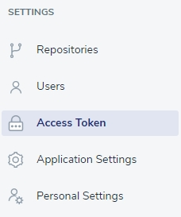

# Access Token

You will need access token, e.g., while creating a new Job with API. 

## Generating new Access Token
Adding new token is very easy - click the 'Access Token' button on the left panel 

and fill the form that will be displayed, enter its name and confirm by clicking the 'Create Access Token' button.

Once the token is generatet, copy it and use as you need. 

<!-- theme: warning -->
>**Remember**, you need to copy your token right after creating it, otherwise you won't be able to access it again. 

And that's it!

## Revoking Access Token

To remove your token, klick the 'Revoke' button next to your token.

The system will ask you to confirm this action.

