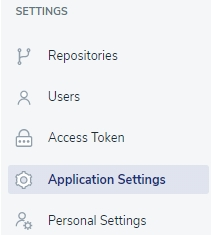
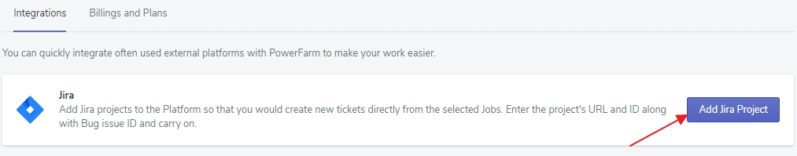
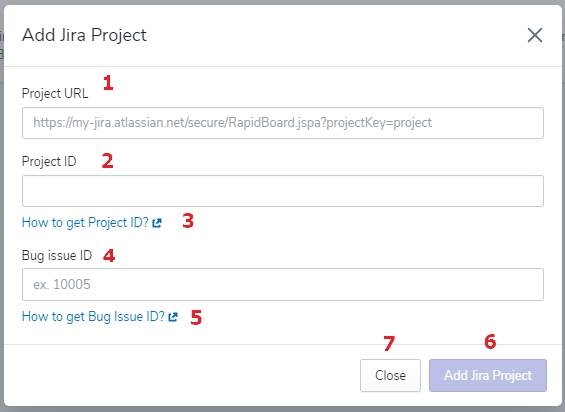
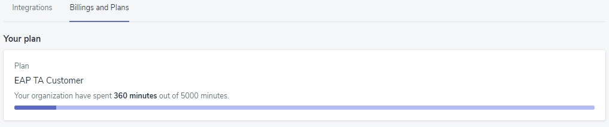

# Application Settings

This is the space where you can integrate external platforms with PowerFarm and check the status of your billing plan.

## Integrations

### Jira

### Jenkins

#### ***Pluggin upload***

To integrate Jenkins with the platform, you need to add a plugging first.

To do so, click the 'Manage Jenkins'(**1**), and, then, the 'Manage Pluggins'(**2**) option.

There, click the 'Advanced' tab.

Scroll to the 'Upload Pluggin', and choose a respective file.

#### ***Freestyle Powerfarm Plugin usage***

Go to your projects, and click the 'Freestyle Powerfarm Plugin usage'. Next, choose 'Configuration' option, and scroll dow to the 'Building' section. 

You need to set up two steps:

1. Create Job
2. Get Job Status

## Billings and Plans

