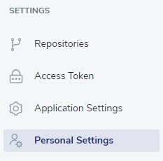
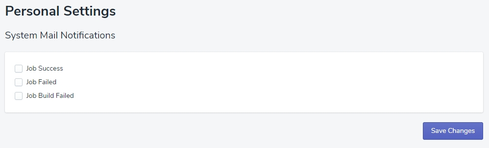

# Personal Settings

## System Mail Notifications

At this space, you can set what kind of mail notifications will be sent to the email provided whle creating your account:
- Job Success
- Job Failed
- Job Build Failed

Just check chosen option and click the 'Save Changes' button.

> **Remember**, you can check all three options and change the settings whenever you need.

