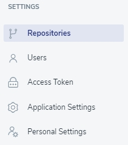

# Repositories

To add the repository, go to ‘Repositories’ on the screen’s left side and click the ‘Assign Repository’ button.

Next, choose the GitLab or GitHub repository on the form displayed on the screen.

## Assign GitHub repository
After selecting the GitHub repository, enter the Access Token. The information on how to do it and the respective [LINK](https://github.com/settings/tokens) is provided below on the form.

### Generating Personal Access Tokens on GitHub

On the GitHub site, select the ‘Generate new token’ button. 

<!-- theme: warning -->
> 💡 **Remember** to mark both `repo` and `admin:repo_hook` permissions.

If you host GitHub on a custom domain, mark the respective checkbox and enter the proper value in the field.

## Assign GitLab repository
After selecting the GitLab repository, enter the Access Token. The information on how to do it, along with the respective [LINK](https://gitlab.com/profile/personal_access_tokens), is provided below on the form.

### Generating Personal Access Tokens on GitLab

On the GitLab site, select the provide your name and expiration date. 

<!-- theme: warning -->
> 💡 **Remember** to mark both `read_repository` and `api` permissions.

If you host GitLab on a custom domain, mark the respective checkbox and enter a proper value in the field.