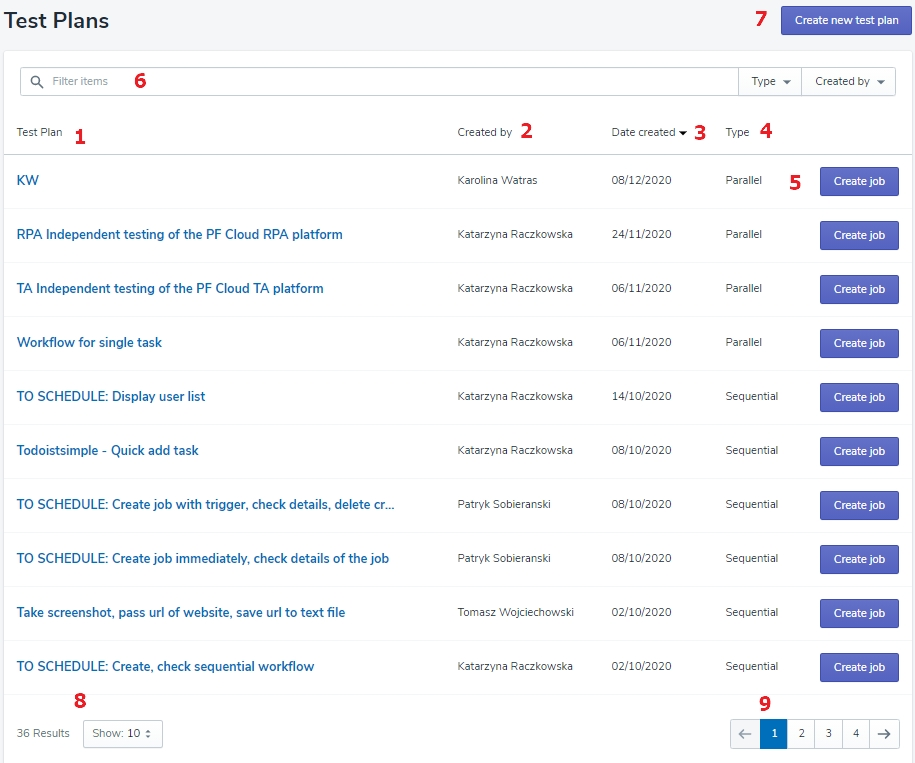

# List of Test Plan - navigation

The space with the list of all Tests Plan allows to create a new Test Plan, create a new Job, provides basic info about the Test Plan,and lets find the Test Plan you are searching for.

1. Test Plan's name, at the same time, the link to the Test Plan's details.
2. Name of Test Plan creator.
3. Date of Test Plan creation.
4. The type of Test Plan.
5. The 'Create Job' button.
6. The filter.
7. The 'Create new test plan' button.
8. The number of all existing Tests and the number of the Tests displayed on one page.
9. The number of pages with Tests.