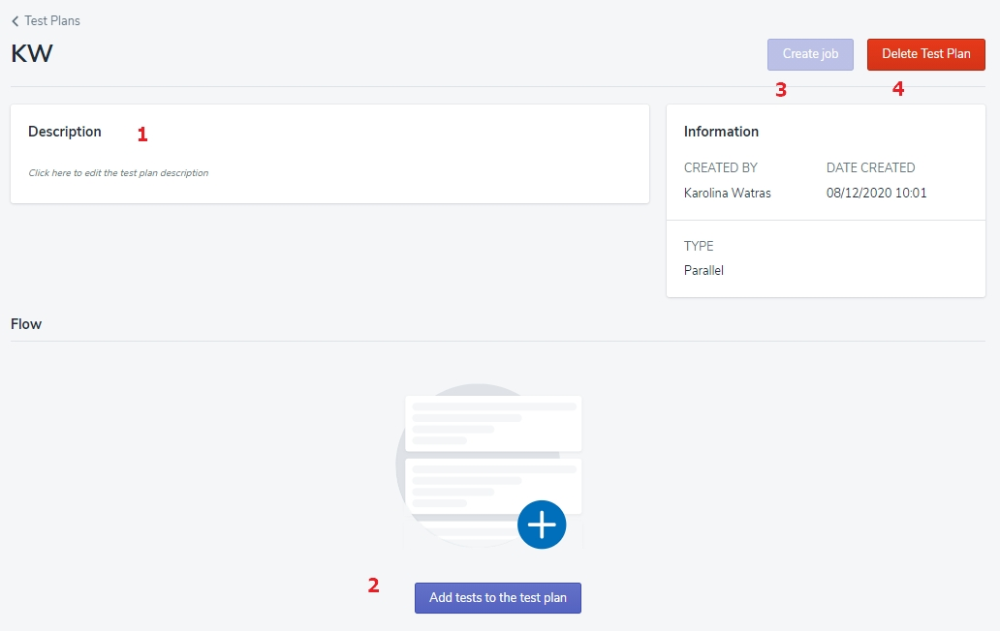

# Test Plans - create and edit

Creating the Test Plan 💬  is another step in your adventure with PowerFarm. And it’s not a complicated operation either.

>💬 Definition alert! 🔔
>**Test Plan** - Set of scripts that can be executed in a sequence or simultaneously without any dependencies. Each test plan can consist of multiple tests. 

## Creating the Test Plan

Click the ‘Create new Test Plan' button on the top right corner of the screen to display the form to fill. 

For now, you only provide the Test Plan's name **1**, an optional description **2**, and choose a Parallel💬 checkbox **3** (in case it's not checked yet). Once you click the 'Create test plan' button **4**, your new Test Plan will appear on the list. 

>💬 Definition alert! 🔔
**Parallel** - scripts are executed at the same time without any dependencies.

## Editing the Test Plan

Select your new Parallel Test Plan from the list to display the details on the screen and add a description **1** (optional).
Now, add the Tests to it. 
It’s easy - just click the ‘Add Test to the Test Plan' button **2** on the bottom of the page... 

...and choose as many Tests as you wish by clicking at the ‘Add’ button next to them on the displayed form.
If there are many Tests on the list, use the filter **1** to find the proper one.

<!-- theme: warning -->
>💡 **Remember**, the form will show all created Tests in the application, so make sure you have a proper amount on the Tests list to execute this step.

Once you’ve finished adding Tests to your new Test Plan, confirm this action by clicking the ‘Save Test Plan' button **2**. If you want to dismiss it, click the ‘Close’ button and none of the chosen Processes will be added. 

<!-- theme: success -->
>Excellent! Give yourself pat on the back and keep on. 👊

In case you need to edit the existing Test Plan, click the ‘Edit Flow’ button.

